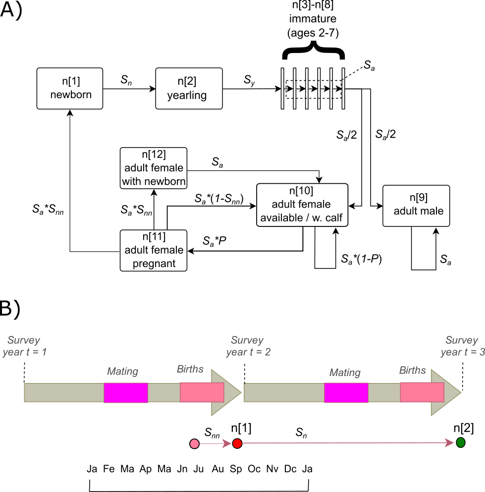

---
params:
 rep_title: "St. Lawrence Beluga Population Model" 
 rep_subtitle: "(Model Version ID and filename)" 
 rep_date: "08/31/2021" 
title: "`r params$rep_title`"
subtitle: "`r params$rep_subtitle`"
date: "`r params$rep_date`"
author: "Prepared for Department of Fisheries and Oceans by M.T. Tinker, Nhydra Ecological"
output: 
  bookdown::html_document2: 
    number_sections: false
    fig_caption: true
    global_numbering: true
editor_options:
  chunk_output_type: console
---

```{r setup, include=FALSE}
knitr::opts_chunk$set(echo = TRUE)
```

```{css, echo = FALSE}
caption {
      color: black;
      font-weight: bold;
      font-size: 1.0em;
    }
```

# Summary

This report summarizes the results of an analysis St. Lawrence Beluga population dynamics, based on the most recent available data on aerial surveys and stranded carcass data. An age-structured population model is fit to these data using Bayesian Markov Chain Monte Carlo (MCMC) methods. The model includes age-dependent survival, stochasticity in pregnancy rates and newborn survival rates. Two major causes of death -  natural mortality (with age-based variation and density-dependent effects) and harvest mortality - are incorporated in the model as competing risks using a proportional hazards formulation. The model is intended to be re-fit each year or as new data become available, and the report updated.

```{r install libraries and load data, include=FALSE, warning=FALSE}
# This code chunk simply makes sure that all the libraries used here are 
# installed on local system, the loads them
existing_Packages<-as.list(installed.packages()[,1])
# Add new packages you might need to this line, to check if they're installed and install missing packages
required_Packages<-c("knitr","readxl", "gtools", "stats", "dplyr", "ggplot2", "fitdistrplus",
                     "bayesplot","lattice","coda","kableExtra","gridExtra","cmdstanr")
#missing_Packages<- required_Packages[!required_Packages%in% existing_Packages]
#if(length(missing_Packages)>0)install.packages(pkgs =  missing_Packages, repos = "http://cran.us.r-project.org")
invisible(lapply(required_Packages, require, character.only=T,quietly = T))
#rm(existing_Packages, missing_Packages, required_Packages)
#
# Load results file
load(file="Results.rdata")
fit = readRDS(file="Results_fit.RDS")
Year = seq(Year1,Year1+Nyrs-1)
```

# Methods
The methods for analyzing the Beluga population can be described in three parts: 1) the process model, a series of equations that describe demographic transitions and which, when solved, predict dynamics in the variables of interest (e.g. population abundance) based on the values of the input parameters; 2) the data model, which describes how empirical data sets are related to the predicted dynamics of the process model; 3) model fitting, which describes how input parameters are estimated.  

## Process model
The structure of the population model follows the process model described by Mosnier et al (2015) and is based on a two-sex, age-structured projection matrix with annual time steps and a 3-year (average) reproductive cycle (Figure \@ref(fig:Fig1)a). Each model time step is assumed to start on September 1st, corresponding to the timing of aerial surveys and approximately 1-3 months after most calves are born (Figure \@ref(fig:Fig1)b). Thus, the first age class tracked by the model, *n*[1], corresponds to newborn calves (both sexes combined) that have survived a neonatal period from birth to the time of the survey (~1-3 months) with probability $S_{nn}$. Newborn calves are still nursing and dependent on their mothers at the time of their first survey, and can survive the next year to become yearling calves, *n*[2], with probability $S_{n}$ Yearlings can then survive to become 2-year-old immature animals, *n*[3], with probability $S_{y}$. The next 6 age classes (*n*[3] to *n*[8], or ages 2 – 7) are considered immature: they are not reproductive, although their survival rates, $S_{a}$, are assumed to be the same as adults and identical for males and females (Mosnier et al. 2015). Animals that survive to age 8 are considered adults, and the matrix model tracks sexes separately from this point on.  Adult males (*n*[9], ages >7) are assumed to survive each year with probability $S_{a}$. Adult females (ages >7) are divided into 3 stages according to their reproductive status at the time of survey: available for breeding (*n*[10]), pregnant (*n*[11]), or with newborns (*n*[12]). Females with a yearling calf are able to become pregnant by the next year and so are grouped with available females (*n*[10]). Transitions between these three reproductive states depend on the probability of available females becoming pregnant (*P*) and the probability that neonatal calves survive ($S_{nn}$) and are conditioned upon female survival ($S_{a}$). Females whose calves do not survive the neonatal period can potentially become available for breeding in the next mating period, thereby shortening their reproductive cycle from 3 years to 2 years (Mosnier et al. 2015). The various demographic transitions and associated vital rates are illustrated as a loop diagram (Figure \@ref(fig:Fig1)) and in matrix form (Figure \@ref(fig:Fig2)).

<br/>

```{r Fig1, echo=FALSE, fig.cap='(ref:Fig1cap)', out.width = '100%'}

```
(ref:Fig1cap) Graphical representation of a beluga population model. A) Loop diagram showing all possible demographic transitions between the 12 age/sex classes, with transition probability equations shown adjacent to each arrow. B) Timeline of population model time steps, which correspond to the timing of aerial surveys in early September of each year, with births occurring 1-3 months before the survey. Neonatal survival ($S_{nn}$) corresponds to survival from birth to the first survey in which the age-0 calf is tracked by the model (stage n[1]), while newborn survival ($S_{n}$) corresponds to survival from stage n[1] to stage n[2] (the yearling age class).

<br/>

```{r Fig2, echo=FALSE, fig.cap='(ref:Fig2cap)', out.width = '100%'}

```
(ref:Fig2cap) Projection matrix $\mathbf{M}$, showing all stage transition probabilities calculated as functions of one or more vital rates.

<br/>

We estimate survival rates using a proportional hazards formulation, whereby annual survival probability (*S*) is calculated as $exp(-\sum{h_j})$, and $h_j$ is the instantaneous per-capita mortality rate (or hazard rate) associated with cause of death *j*. For computational simplicity we express hazards in log form, such that the various fixed and random effects that affect the hazard rate can be combined as terms in a simple linear equation. To improve efficiency of parameter estimation and obtain appropriately-centered priors we also include an arbitrary constant in these linear log-hazards equations; all additional terms can thus be interpreted as log hazard ratios relative to the baseline hazards implied by this constant (although we note that the precise value of the constant is unimportant as the other estimated parameters adjust accordingly).

For neonatal newborns, the hazard rate at time *t*, $h_{n[t]}$, is calculated as:

$$
\begin{equation}
{h_{n[t]}} = \exp \left( { - 0.85 + {\gamma _n} + \phi  \cdot N_{t - 1}^* + {\varepsilon _{n[t]}}} \right) (\#eq:f1)
\end{equation}
$$ 
where parameter $\gamma_n$ represents the mean log hazard ratio for newborns relative to an arbitrarily-set baseline value (constant -0.85, corresponding to a survival rate of 65%); parameter $\phi$ controls density-dependent effects on newborn survival ($N^*$ represents relative population density, calculated as abundance at time t divided by 10,000, with re-scaling applied to simplify parameter estimation); and parameter $\epsilon_{n[t]}$ represents the random effect of environmental stochasticity on newborn survival in year *t*, assumed to be normally distributed with mean of 0 and standard deviation $\sigma_n$ (itself a fitted parameter). We assume $h_{n[t]}$ is scaled to a 3-month period from birth to survey, and thus neonatal survival for this period is calculated as:
$$
\begin{equation}
{S_{nn[t]}} = \exp ( - {h_{n[t]}}) (\#eq:f2)
\end{equation}
$$ 
The survival rate of newborn calves from the time of their first survey to their second survey as yearling calves is calculated as the product of continued survival from neonatal hazards for 6 months followed by survival from yearling hazards for 6 months:
$$
\begin{equation}
{{S}_{n[t]}}={{\left[ {{S}_{nn[t]}} \right]}^{2}}\cdot {{\left[ {{S}_{y[t]}} \right]}^{{\scriptstyle{}^{1}\!\!\diagup\!\!{}_{2}\;}}} (\#eq:f3)
\end{equation}
$$
In equation \@ref(eq:f3) we note that because neonatal survival ($S_{nn[t]}$) is scaled to a 3-month period, it must be squared to obtain probability of survival for 6 months, whereas the yearling survival rate ($S_{y[t]}$) is scaled to a 1-year period and thus its square root gives the probability of survival for 6 months. We calculate the yearling survival rate, $S_{y[t]}$, as:
$$
\begin{align}
 & {{S}_{y[t]}}=\exp \left( -[{{h}_{y}}+{{h}_{H[t]}}] \right), \\ 
 & {{h}_{y}}=\exp \left( -2.25+{{\gamma }_{a}}+{{\gamma }_{y}} \right), \\ 
 & {{h}_{H[t]}}=\exp \left( -5+{{{\bar{\gamma }}}_{H}}+{{\gamma }_{H[t]}} \right) \\ (\#eq:f4)
\end{align}
$$
In equation \@ref(eq:f4), yearlings are assumed to experience competing hazards from natural mortality ($h_y$) and harvest mortality ($h_{H[t]}$), although we note that harvest mortality hazards are forced to 0 after 1959. In the equation for natural hazards ($h_y$), parameter $\gamma_y$ represents the log hazard ratio for yearlings relative to adult hazards, and parameter $\gamma_a$ represents the log hazard ratio for adults relative to an arbitrarily-set baseline value (constant -2.25, corresponding to a survival rate of 90%). In the equation for harvest hazards ($h_{H[t]}$), parameter ${{{\bar{\gamma }}}_{H}}$ represents the mean log hazard ratio for harvests over all years (prior to 1960), relative to an arbitrarily-set baseline value (constant -5, corresponding to a survival rate of 0.99), and $\gamma_{H[t]}$ represents deviations in annual log hazards for harvests relative to this mean value, estimated as a random effect with mean of 0 and standard deviation of $\sigma_H$.

Adult survival rates are computed similarly to yearling survival rates:
$$
\begin{align}
  & {{S}_{a[t]}}=\exp \left( -[{{h}_{a}}+{{h}_{H[t]}}] \right), \\ 
 & {{h}_{a}}=\exp \left( -2.25+{{\gamma }_{a}} \right) \\ (\#eq:f5)
\end{align}
$$
In equation \@ref(eq:f5), adults are assumed to experience competing hazards from natural mortality ($h_a$) and harvest mortality ($h_{H[t]}$), where the latter are identical to those experienced by yearlings (as described above) and are forced to 0 after 1959. In the case of natural hazards ($h_a$), parameter $\gamma_a$ represents the log hazard ratio for adults relative to an arbitrarily-set baseline value (constant -2.25, corresponding to a survival rate of 90%). 

Adult females that are available for reproduction at year *t* (stage *n*[10]) can transition to pregnant status at year *t*+1 (conditional upon survival) with probability $P_t$, which we calculate as a logit function:
$$
\begin{equation}
\text{logit}({{P}_{t}})=\alpha +{{\varepsilon }_{p[t]}} (\#eq:f6)
\end{equation}
$$ 
where parameter $\alpha$ represents the logit-transformed mean pregnancy rate, and parameter $\epsilon_{p[t]}$ represents stochastic variation in pregnancy rates, assumed to be normally distributed across years with mean of 0 and standard deviation $\sigma_p$.

Population dynamics are calculated using standard methods of matrix multiplication: the population vector at time *t* (represented as $\mathbf{n}_t$, where $\mathbf{n}_t$ = <$n[1]_t$, $n[2]_t$,…$n[12]_t$> ) is calculated as the product of the transition matrix $\mathbf{M}_t$ (Figure 2) and $\mathbf{n}_{t-1}$, the population vector at *t*-1. Summing across all age classes of the population vector at time *t* gives the expected population abundance, $N_t$. To initiate the population vector, we treat log($N_1$) as a parameter to be fit and then calculate $\mathbf{n}_1$ by multiplying $N_1$ by the stable stage distribution associated with the best-fit set of vital rates (calculated as the scaled right eigenvector of $\mathbf{M}_1$). Several other derived variables are also tracked by the model to aid in fitting. We calculate the proportion of juvenile animals (<2 years old) for each year, $p_{J[t]}$, as the number of animals in stages *n*[1] and *n*[2] divided by the total abundance, $N_t$. We also compute for each year a vector of the expected number of dead animals produced in age class i, which we represent as $\mathbf{d}_t$ (where $\mathbf{d}_t$ = <$d[1]_t$, $d[2]_t$,…$d[12]_t$> ) and calculate as: 
$$
\begin{align}
 & d{{[i]}_{t}}=n{{[i]}_{t-1}}\cdot (1-{{S}_{a[t]}})\quad for\ 3\le i\le 12 \\ 
 & d{{[i]}_{t}}=n{{[i]}_{t-1}}\cdot (1-{{S}_{y[t]}})\quad for\ i=2 \\ 
 & d{{[i]}_{t}}=n{{[i]}_{t-1}}\cdot (1-{{S}_{n[t]}})+\left[ n{{[11]}_{t-1}}\cdot {{S}_{a[t]}}\cdot (1-{{S}_{nn[t]}}) \right]\quad for\ i=1 \\  (\#eq:f7)
\end{align}
$$
Finally, we track the expected number of animals harvested each year. To do this we take advantage of the competing hazards formulation for survival, which allows us to compute the fraction of mortality in each age class (for yearlings and older animals) attributable to harvest:
$$
\begin{align}
 & fH{{[i]}_{t}}={{{h}_{H[t]}}}/{\left( {{h}_{H[t]}}+{{h}_{a}} \right)}\;\quad for\ 3\le i\le 12 \\ 
 & fH{{[i]}_{t}}={{{h}_{H[t]}}}/{\left( {{h}_{H[t]}}+{{h}_{y}} \right)}\;\quad for\ i=2 \\ (\#eq:f8)
\end{align}
$$
We then use these fractions of mortality attributable to harvest to calculate the total expected harvest numbers for each year:
$$
\begin{equation}
{{H}_{t}}=\sum\limits_{i=2}^{12}{fH{{[i]}_{t}}\cdot d{{[i]}_{t}}} (\#eq:f9)
\end{equation}
$$ 
<br/>

## Data model
The predicted variables generated by the process model are compared to 4 observed data sets: abundance estimates from aerial surveys, proportions of animals in aerial surveys that were juveniles, stranded carcass counts (for newborns and older animals) and harvest counts. The aerial survey abundance estimates ($Nobs_t$) are assumed to follow a gamma distribution, with mean values corresponding to model-predicted abundance:
$$
\begin{equation}
Nob{{s}_{t}}\sim gamma\left( {{N}_{t}}\cdot {{\tau }_{t}},\ {{\tau }_{t}} \right) (\#eq:f10)
\end{equation}
$$ 
where the precision parameter (also termed the “inverse scale parameter”) for each year, $\tau_t$, is computed from the standard errors associated with each aerial survey estimate: 
$$
\begin{equation}
{{\tau }_{t}}={}^{Nob{{s}_{t}}}\!\!\diagup\!\!{}_{{{\left( S{{E}_{t}} \right)}^{2}}}\; (\#eq:f11)
\end{equation}
$$ 
The juvenile proportions observed in aerial surveys are assumed to follow a beta distribution, with mean values corresponding to the model-predicted proportions of juvenile animals:
$$
\begin{equation}
pJu{{v}_{t}}\sim beta\left( {{p}_{J[t]}}\cdot \upsilon ,\ (1-{{p}_{J[t]}})\cdot \upsilon  \right) (\#eq:f12)
\end{equation}
$$ 
where $\upsilon$ represents a precision parameter calculated prior to model fitting and scaled to approximate the variance associated with a binomial distribution given the observed counts of juveniles relative to total counts. 

The annual counts of stranded carcasses for newborns ($StrndNB_t$) and all older age classes ($StrndOA_t$) are assumed to follow a Poisson distribution, with mean values corresponding to the model-predicted estimates of dead animals re-scaled by stage-specific detection probabilities:
$$
\begin{align}
 & StrndN{{B}_{t}}\sim Poisson\left( d{{[1]}_{t}}\cdot {{\theta }_{NB}} \right) \\ 
 & StrndO{{A}_{t}}\sim Poisson\left( \sum\limits_{i=2}^{12}{d{{[i]}_{t}}\cdot {{\theta }_{OA}}} \right) \\ (\#eq:f13)
\end{align}
$$
where the detection probabilities for newborn carcasses ($\theta_{NB}$) and older animal carcasses ($\theta_{OA}$) are parameters to be fit. 

The observed harvest counts ($Hobs_t$, for *t* < 1960) are assumed to follow a gamma distribution, with mean values corresponding to model-predicted harvest estimates and precision parameter set to an arbitrarily large value (100) reflecting a high degree of precision in harvest records:
$$
\begin{equation}
Hob{{s}_{t}}\sim gamma\left( {{H}_{t}}\cdot 100,\ 100 \right) (\#eq:f14)
\end{equation}
$$ 

<br/>

## Model fitting
The observed data variables constrain the possible values of unknown parameters in the process model (summarized in Table \@ref(tab:Table1)), allowing us to estimate posterior distributions for these parameters using standard Markov Chain Monte Carlo (MCMC) methods. We use weakly informed prior distributions for all parameters (i.e., informed based on biological feasibility but having minimal information specific to the analysis), including a normal prior ($\bar{x}$ = 8.5, sd = 1) for $log(N_1)$, normal priors ($\bar{x}$ = 0, sd = 1) for $\gamma_n$ and ${{{\bar{\gamma }}}_{H}}$, normal priors ($\bar{x}$ = 0, sd = 2) for $\gamma_y$, $\gamma_a$ and $\alpha$, a half-normal prior ($\bar{x}$ = 0, sd = 1) for $\phi$, half-Cauchy priors (location = 0, scale = 1) for variance parameters $\sigma_p$, $\sigma_n$, and $\sigma_H$, and beta priors (a=1, b=5) for carcass detection probability parameters $\theta_{NB}$ and $\theta_{OA}$. We used R (R.Core.Team 2014) and Stan software (Carpenter et al. 2017) to code and fit the model, saving 10,000 samples after a burn-in of 500 samples. We evaluate model convergence by graphical examination of trace plots from 20 independent chains and by ensuring that Gelman-Rubin convergence diagnostic (R-hat) is <1.1 for all fitted model parameters (Raftery and Lewis 1995). We conduct graphical posterior predictive checking to evaluate model goodness of fit, ensuring that out-of-sample predictive distributions of abundance are consistent with distributions of observed data, and we calculate a Bayesian P-value based on observed vs. out-of-sample test statistics (Pearson chi-2), which for a well-fit model should fall between 0.2 and 0.8 (Gelman et al. 1996, Gelman 2005). Model results are summarized by reporting the means, standard errors and 95% Credible Interval (CI) of the posterior distributions for base model parameters (Table \@ref(tab:Table2)) and by creating various plots of base and derived parameters.

<br/>

Table: (\#tab:Table1) Summary of estimated parameters

Parameter | Description
----------|------------
$log(N_1)$| Initial population abundance (1912), log-transformed 
$\alpha$  | Mean pregnancy rate for available females (or females with yearling calves), logit-transformed 
$\gamma_n$| Mean log hazard ratio for newborns relative to arbitrary baseline (survival ~ 0.65)
$\phi$    | Density-dependent effects on newborn survival
$\gamma_y$| Mean log hazard ratio for yearlings relative to adult hazards
$\gamma_a$| Mean log hazard ratio for adults relative to arbitrary baseline (survival ~ 0.90)
${{{\bar{\gamma }}}_{H}}$| Mean log hazard ratio for harvest mortality relative to arbitrary baseline (survival ~ 0.99)
$\sigma_p$| Variance in annual pregnancy rates for available females 
$\sigma_n$| Variance in annual newborn hazard rates 
$\sigma_H$| Variance in annual harvest hazard rates (prior to 1960)
$\theta_{NB}$| Probability of carcass detection, newborns
$\theta_{OA}$| Probability of carcass detection, older animals

<br/>

# Results

Fitting the model to the observed data sets resulted in excellent convergence, with R-hat < 1.1 for all estimated parameters (Table \@ref(tab:Table2)) and trace plots indicating well-mixed chains (Figure \@ref(fig:Fig3)). Graphical posterior predictive checks (Figure \@ref(fig:Fig4)) indicate excellent model fit.

<br/>

```{r Table2, echo=FALSE}
ix = c(which(vns=="logN1"),which(vns=="alpha"),which(vns=="gamma_N"),
       which(vns=="phi"),which(vns=="gamma_Y"),which(vns=="gamma_A"),
       which(vns=="gamma_H_mn"),which(vns=="sig_P"),which(vns=="sig_N"),
       which(vns=="sig_H"),which(vns=="theta_NB"),which(vns=="theta_OA"),
       which(vns=="S_A"),which(vns=="S_Y"),which(vns=="S_N_mn"),
       which(vns=="S_NN_mn"),which(vns=="Pr_mn")) 

statsum = sumstats[ix,c(1,3,4,8,10)]

row.names(statsum) = c("log(N_1)","alpha","gamma_n","phi","gamma_y",
                       "gamma_a","gamma_bar_H","sigma_p","sigma_n","sigma_H",
                       "theta_NB","theta_OA","S_a","S_y","S_n (mean)",
                       "S_nn (mean)","P (mean)")
kable(statsum,digits=3,
      caption = "<strong>Posterior distribution summaries of parameters estimated by the model</strong>",
      escape = FALSE,
      format = "html") %>% kable_styling(bootstrap_options = "basic")

```

<br/>

```{r Fig3, echo=FALSE, warning=FALSE, message=FALSE, fig.cap='(ref:Fig3cap)', out.width = '60%', fig.asp = 1.8}

plt_trace1 = mcmc_trace(fit$draws("logN1"))
plt_trace2 = mcmc_trace(fit$draws("gamma_A"))
grid.arrange(plt_trace1,plt_trace2)

```
(ref:Fig3cap) Trace plots for two of the estimated parameters, illustrating mixing of multiple chains of posterior samples.  

<br/>

```{r Fig4, echo=FALSE, warning=FALSE, message=FALSE, fig.cap='(ref:Fig4cap)', out.width = '60%', fig.asp = 1.6}

set.seed(123)
rr = sample(Nsims,1000)
y = ObsS ;
y_rep <- (as.matrix(mcmc[,which(startsWith(vn,"ynew["))]))
plt_ppc1 = ppc_dens_overlay(y, y_rep[rr[1:100],]) + 
  ggtitle ("Posterior predictive distribution, observed vs out-of-sample predictions") +
  labs(x = "Survey Counts",y = "Frequency") + theme_classic()
#
Bayes_P = sumstats[which(vns=="ppp"),1]
if(Bayes_P>0.75){Bayes_P=1-Bayes_P}
xx = as.matrix(mcmc[,vns=="Tstat"][rr])
yy = as.matrix(mcmc[,vns=="Tstat_new"][rr])
df_ppc = data.frame(x = log(xx), y = log(yy))
plt_ppc2 = ggplot(df_ppc,aes(x=x,y=y)) +
  geom_point(color="blue") + 
  labs(x="Discrepancy measure for actual data set",
       y = "Discrepancy measure for new data",
       title= "Posterior predictive check, sum of squared Pearson residuals", 
       subtitle = paste0("Bayesian-P = ",Bayes_P)) +
  geom_abline(slope=1,intercept=0) +
  theme_classic()
grid.arrange(plt_ppc1,plt_ppc2)

```
(ref:Fig4cap) Posterior predictive plots, comparing distributions of randomly generated "new" (out-of-sample) data with observed data from aerial surveys. Top panel shows frequency histogram of survey counts for observed vs. new data. Lower panel shows a scatter plot of discrepancy measure statistics (sum of squared Pearson residuals) for posterior samples of observed vs. new data, and the associated Bayesian-P value. For a well-fit model, the cloud of points shpuld be scattered around the 1:1 line, and the Bayesian-P value should be between 0.1 and 0.9.  

<br/>

The estimates of Beluga vital rates were consistent with those estimated previously by Mosnier et al. (2015): adult age classes had a high survival rate of over 90%, with a low degree of estimation uncertainty (a narrow credible interval); yearling survival was slightly lower than adult survival with somewhat more estimation uncertainty; and estimates of mean survival rates of newborns and neonatal calves (the latter corresponding to survival probability from birth to survey) were even lower with considerable estimation uncertainty (Table \@ref(tab:Table2), Figure \@ref(fig:Fig5)). The estimated mean pregnancy rate had the highest level of estimation uncertainty (Figure \@ref(fig:Fig5)). However, it is important to note that the posterior distributions for all vital rate estimates showed reduced variance and provide much more precise estimates than their prior distributions (Figure \@ref(fig:Fig6)). 

<br/>

```{r Fig5, echo=FALSE, warning=FALSE, message=FALSE, fig.cap='(ref:Fig5cap)', out.width = '80%', fig.asp = 1.1}

mcmc_areas(fit$draws(variables = c("S_A","S_Y","S_N_mn","S_NN_mn","Pr_mn")),
           area_method="equal height",
           prob = 0.8) + 
  ggtitle("Posterior distributions, vital rates") +
  scale_y_discrete(labels=c("Survival, adult","Survival, yearling",
                            "Survival, newborn", "Survival, neonatal (3 mo)",
                            "Pregnancy rate")) +
  labs(x="Parameter value",y="Posterior sample density") +
  theme_classic()

```
(ref:Fig5cap) Posterior distributions for model-estimated vital rates (computed as derived parameters from log hazard rates). Each density plot shows the distribution of posterior samples: the dark line shows the mean value and the shaded areas indicate the 90% CI. Mean values are shown for newborn and neonatal survival and pregnancy rates, as these vital rates vary from year to year due to environmental stochasticity and density dependent effects.  

<br/>

```{r Fig6, echo=FALSE, warning=FALSE, message=FALSE, fig.cap='(ref:Fig6cap)', out.width = '80%', fig.asp = .8}

post_gmmaA = mcmc[,which(vn=="gamma_A")]
post_gmmaY = mcmc[,which(vn=="gamma_Y")]
post_S_A = mcmc[,which(vn=="S_A")]
tmp = rnorm(Nsims*2.5,0,2); tmp = sample(tmp[tmp>-2 & tmp<3],Nsims)
pri_S_A = exp(-exp(tmp - 2.25))
df_post_SA = data.frame(Estimate = c(rep("Prior",length(pri_S_A)),
                                     rep("Posterior",length(post_S_A)) ),
                        Value = c(pri_S_A,post_S_A)) 
df_post_SA$Estimate = factor(df_post_SA$Estimate)
plt1 = ggplot(df_post_SA,aes(x=Value,group=Estimate,fill=Estimate)) +
  geom_density(adjust=1.5,alpha=0.3) +
  scale_x_continuous(limits = c(0,1)) +
  ggtitle("Prior vs Posterior, Adult Survival") +
  theme_classic() + theme(legend.position = "none")
#
post_S_Y = mcmc[,which(vn=="S_Y")]
tmp = rnorm(Nsims*2.5,0,2); tmp = sample(tmp[tmp>0 & tmp<3],Nsims)
pri_S_Y = exp(-exp(-2.25 + tmp + post_gmmaA ))
df_post_SY = data.frame(Estimate = c(rep("Prior",length(pri_S_Y)),
                                     rep("Posterior",length(post_S_Y)) ),
                        Value = c(pri_S_Y,post_S_Y)) 
df_post_SY$Estimate = factor(df_post_SY$Estimate)
plt2 = ggplot(df_post_SY,aes(x=Value,group=Estimate,fill=Estimate)) +
  geom_density(adjust=1.5,alpha=0.3) +
  scale_x_continuous(limits = c(0,1)) +
  ggtitle("Prior vs Posterior, Yearling Survival") +
  theme_classic() + theme(legend.position = "none")
#
post_S_NN = mcmc[,which(vn=="S_NN_mn")]
tmp = rnorm(Nsims*2.5,0,1); tmp = sample(tmp[tmp>-3 & tmp<3],Nsims)
tmp2 = rnorm(Nsims*2.5,0,1); tmp2 = sample(tmp2[tmp2>0],Nsims)
pri_S_NN = (exp(-exp(-.85 + tmp + 0.1*tmp2)))
df_post_SN = data.frame(Estimate = c(rep("Prior",length(pri_S_NN)),
                                     rep("Posterior",length(post_S_NN)) ),
                        Value = c(pri_S_NN,post_S_NN)) 
df_post_SN$Estimate = factor(df_post_SN$Estimate)
plt3 = ggplot(df_post_SN,aes(x=Value,group=Estimate,fill=Estimate)) +
  geom_density(adjust=1.5,alpha=0.3) +
  scale_x_continuous(limits = c(0,1)) +
  ggtitle("Prior vs Posterior, Neonatal Survival") +
  theme_classic()
#
post_Pr = mcmc[,which(vn=="Pr_mn")]
tmp = rnorm(Nsims,0,1.5)
pri_Pr = inv.logit(tmp)
df_post_Pr = data.frame(Estimate = c(rep("Prior",length(pri_Pr)),
                                     rep("Posterior",length(post_Pr)) ),
                        Value = c(pri_Pr,post_Pr)) 
df_post_Pr$Estimate = factor(df_post_Pr$Estimate)
plt4 = ggplot(df_post_Pr,aes(x=Value,group=Estimate,fill=Estimate)) +
  geom_density(adjust=1.5,alpha=0.3) +
  scale_x_continuous(limits = c(0,1)) +
  ggtitle("Prior vs Posterior, Pregancy Rate") +
  theme_classic()
#
rm(tmp,tmp2)
grid.arrange(grobs=list(plt1,plt3,plt2,plt4),nrow=2)

```
(ref:Fig6cap) Comparison of prior vs. posterior distributions for model-estimated vital rates (computed as derived parameters from log hazard rates). Note that survival estimates exclude any effects of harvest, and mean values are shown for neonatal survival and pregnancy rates, both of which vary from year to year due to environmental stochasticity and (in the case of neonatal survival) density dependent effects. 

<br/>

The estimated patterns of temporal variation in neonatal/newborn survival rates and pregnancy rates (since the initiation of aerial surveys around 1990) are also in good agreement with those reported by Mosnier et al. (2015), as illustrated in Figure \@ref(fig:Fig7). Specific features of this variation include cyclical "peaks and valleys" in both vital rates, with peaks in pregnancy rates occurring in 1996, 2000 and 2011, and peaks in newborn survival (equivalent to valleys in mortality) occurring in 2001, 2004-06, and 2009. Also evident was an overall tendency towards lower and more variable newborn survival after 1999 (Figure \@ref(fig:Fig7)a). Because the model tracks females with differing reproductive status as distinct stages of the population, we can easily examine temporal trends in the relative proportion of females in each state (Figure \@ref(fig:Fig8)). Not surprisingly, such an examination reveals that peaks in pregnancy rates are associated with corresponding peaks in the proportion of adult females that are pregnant (e.g. year 2000; Figure \@ref(fig:Fig8)b) as well as peaks in the numbers of females with calves the following year (e.g. year 2001; Figure \@ref(fig:Fig8)c). The combined trends in vital rates and female reproductive status result in good agreement between the predicted and observed proportions of the population composed of juvenile animals (Figure \@ref(fig:Fig8)d), a metric which exhibits greater volatility and a declining trend after 1999. 

Other model results that are consistent with previous findings (Mosnier et al. 2015) include a low rate of carcass detection for stranded newborns (~6%) as compared to older animals (~ 25%; Figure \@ref(fig:Fig9)), and the estimated trends in overall abundance, which show a pronounced decline over the first half of the last century up to approximately 1960 (when harvests were discontinued), followed by a period of stagnant growth up until approximately 1999, after which there appears to be a declining trend (Figure \@ref(fig:Fig10)). 

<br/>

```{r Fig7, echo=FALSE, warning=FALSE, message=FALSE, fig.cap='(ref:Fig7cap)', out.width = '80%', fig.asp = 1.1}

Spred = sumstats[which(startsWith(vns,"S_NN[")),1]
Spred_lo = sumstats[which(startsWith(vns,"S_NN[")),5]
Spred_hi = sumstats[which(startsWith(vns,"S_NN[")),7]
df_Splt = data.frame(Year=Years,Spred=Spred,
                     Spred_lo=Spred_lo,Spred_hi=Spred_hi)
#
plt_SvNb = ggplot(df_Splt[which(Years>1982 & Years<2013),],aes(x=Year,y=Spred)) +
  geom_ribbon(aes(ymin=Spred_lo,ymax=Spred_hi),alpha=0.3) +
  geom_line() +
  labs(x="Year",y="Estimated survival rate, neonates") +
  ggtitle("Beluga neonatal survival, model projections (1990-2012)") +
  theme_classic()
#
Ppred = sumstats[which(startsWith(vns,"Pr[")),1]
Ppred_lo = sumstats[which(startsWith(vns,"Pr[")),5]
Ppred_hi = sumstats[which(startsWith(vns,"Pr[")),7]
df_Pplt = data.frame(Year=Years,Ppred=Ppred,
                     Ppred_lo=Ppred_lo,Ppred_hi=Ppred_hi)
#
plt_PrgRt = ggplot(df_Pplt[which(Years>1982 & Years<2013),],aes(x=Year,y=Ppred)) +
  geom_ribbon(aes(ymin=Ppred_lo,ymax=Ppred_hi),alpha=0.3) +
  geom_line() +
  labs(x="Year",y="Estimated pregancy rate") +
  ggtitle("Beluga adult pregnancy rate, model projections (1990-2012)") +
  theme_classic()
#
grid.arrange(plt_SvNb,plt_PrgRt)

```
(ref:Fig7cap) Ribbon plots illustrating temporal variation in neonatal survival rates (top panel) and pregnancy rates (lower panel). Black lines show the mean trends while shaded grey ribbons show the 95% credible intervals around the annual estimates.

<br/>

```{r Fig8, echo=FALSE, warning=FALSE, message=FALSE, fig.cap='(ref:Fig8cap)', out.width = '80%', fig.asp = 1.2}

P_Av_pred = sumstats[which(startsWith(vns,"ppn_Av[")),1]
P_Av_pred_lo = sumstats[which(startsWith(vns,"ppn_Av[")),5]
P_Av_pred_hi = sumstats[which(startsWith(vns,"ppn_Av[")),7]
P_Pr_pred = sumstats[which(startsWith(vns,"ppn_Pr[")),1]
P_Pr_pred_lo = sumstats[which(startsWith(vns,"ppn_Pr[")),5]
P_Pr_pred_hi = sumstats[which(startsWith(vns,"ppn_Pr[")),7]
P_Wc_pred = sumstats[which(startsWith(vns,"ppn_Wc[")),1]
P_Wc_pred_lo = sumstats[which(startsWith(vns,"ppn_Wc[")),5]
P_Wc_pred_hi = sumstats[which(startsWith(vns,"ppn_Wc[")),7]
df_Femstg_plt = data.frame(Year=Years,Status=rep("Available",Nyrs),Prop=P_Av_pred,
                                               Prop_lo=P_Av_pred_lo,Prop_hi=P_Av_pred_hi)
df_Femstg_plt = rbind(df_Femstg_plt,data.frame(Year=Years,Status=rep("Pregnant",Nyrs),
                                               Prop=P_Pr_pred,
                                               Prop_lo=P_Pr_pred_lo,Prop_hi=P_Pr_pred_hi) )
df_Femstg_plt = rbind(df_Femstg_plt,data.frame(Year=Years,Status=rep("With_calf",Nyrs),
                                               Prop=P_Wc_pred,
                                               Prop_lo=P_Wc_pred_lo,Prop_hi=P_Wc_pred_hi) )                      
#
plt_pAv = ggplot(df_Femstg_plt[which(df_Femstg_plt$Year>1982 & df_Femstg_plt$Status=="Available" ),],
                 aes(x=Year,y=Prop)) +  # group=Status,color=Status,fill=Status
  geom_ribbon(aes(ymin=Prop_lo,ymax=Prop_hi),alpha=0.3) +
  geom_line() +
  labs(x="Year",y="Estimate") +
  ggtitle(paste0("Beluga female status (1983-",as.character(YearT),"): Proportion Available")) +
  theme_classic()
plt_pPr = ggplot(df_Femstg_plt[which(df_Femstg_plt$Year>1982 & df_Femstg_plt$Status=="Pregnant" ),],
                 aes(x=Year,y=Prop)) +  # group=Status,color=Status,fill=Status
  geom_ribbon(aes(ymin=Prop_lo,ymax=Prop_hi),alpha=0.3) +
  geom_line() +
  labs(x="Year",y="Estimate") +
  ggtitle(paste0("Beluga female status (1983-",as.character(YearT),"): Proportion Pregnant")) +
  theme_classic()
plt_pWc = ggplot(df_Femstg_plt[which(df_Femstg_plt$Year>1982 & df_Femstg_plt$Status=="With_calf" ),],
                 aes(x=Year,y=Prop)) +  # group=Status,color=Status,fill=Status
  geom_ribbon(aes(ymin=Prop_lo,ymax=Prop_hi),alpha=0.3) +
  geom_line() +
  labs(x="Year",y="Estimate") +
  ggtitle(paste0("Beluga female status (1983-",as.character(YearT),"): Proportion With Calf")) +
  theme_classic()
#
PJpred = sumstats[which(startsWith(vns,"ppn_J[")),1]
PJpred_lo = sumstats[which(startsWith(vns,"ppn_J[")),4]
PJpred_hi = sumstats[which(startsWith(vns,"ppn_J[")),8]
df_PJplt = data.frame(Year=Years,PJpred=PJpred,
                      PJpred_lo=PJpred_lo,PJpred_hi=PJpred_hi)
df_PJplt$PJ_obs = rep(NA,Nyrs); df_PJplt$PJ_obs_se = rep(NA,Nyrs)
df_PJplt$PJ_obs[YrSv] = PJ
N_ob = round(df_Surv$`Pop size estimate`/(2.021*2.09))
N_jv = PJ*N_ob ; se = sqrt(N_ob*PJ*(1-PJ)); CV = se/N_jv
df_PJplt$PJ_obs_se[YrSv] = CV*PJ
plt_pJv = ggplot(df_PJplt[which(Years>1982),],aes(x=Year,y=PJpred)) +
  geom_ribbon(aes(ymin=PJpred_lo,ymax=PJpred_hi),alpha=0.3) +
  geom_line() +
  geom_point(aes(y=PJ_obs)) +
  geom_errorbar(aes(ymin=PJ_obs-1.96*PJ_obs_se,ymax=PJ_obs+1.96*PJ_obs_se)) +
  labs(x="Year",y="Estimate") +
  ggtitle(paste0("Beluga survey age structure (1983-",
                 as.character(YearT),"): Proportion Juvenile")) +
  theme_classic()
#
grid.arrange(grobs=list(plt_pAv,plt_pPr,plt_pWc,plt_pJv),nrow=4)

```
(ref:Fig8cap) Ribbon plots illustrating temporal variation in the proportion of adult females in each of 3 reproductive states (top 3 panels) and Beluga population age structure (bottom panel). In the bottom panel, the observed proportions of juvenile animals (based on aerial photographic surveys) are plotted for comparison, with points showing survey point estimates and error bars showing the associated standard errors (based on sampling variance of a binomial distribution). In all plots the black lines show the mean trends while shaded grey ribbons show the 95% credible intervals around the annual estimates.

<br/>

```{r Fig9, echo=FALSE, warning=FALSE, message=FALSE, fig.cap='(ref:Fig9cap)', out.width = '60%', fig.asp = 0.8}

mcmc_areas(fit$draws(variables = c("theta_NB","theta_OA")),
           area_method="equal height",
           prob = 0.8) + 
  scale_y_discrete(labels=c("Prob detect Newborn","Prob detect Older")) +
  ggtitle("Posterior distributions, carcass detection probabilities") +
  labs(x="Parameter value",y="Posterior sample density") +
  theme_classic()

```
(ref:Fig9cap) Posterior distributions for model-estimated probabilities of carcass detection for stranded Beluga whales of two age classes, newborns and older animals. Each density plot shows the distribution of posterior samples: the dark line shows the mean value and the shaded areas indicate the 90% CI. 

<br/>

```{r Fig10, echo=FALSE, warning=FALSE, message=FALSE, fig.cap='(ref:Fig10cap)', out.width = '80%', fig.asp = 0.8}

Npred = sumstats[which(startsWith(vns,"N[")),1]
Npred_lo = sumstats[which(startsWith(vns,"N[")),4]
Npred_hi = sumstats[which(startsWith(vns,"N[")),8]
df_Nplt = data.frame(Year=Years,Npred=Npred,
                       Npred_lo=Npred_lo,Npred_hi=Npred_hi)
df_Nplt$Survey_est = rep(NA,Nyrs); df_Nplt$Survey_est_SE = rep(NA,Nyrs)
df_Nplt$Survey_est[YrSv] = ObsS; df_Nplt$Survey_est_SE[YrSv] = sqrt(VarS)
#
ggplot(df_Nplt[which(Years>1925),],aes(x=Year,y=Npred)) +
  geom_ribbon(aes(ymin=Npred_lo,ymax=Npred_hi),alpha=0.3) +
  geom_line() +
  geom_point(aes(y=Survey_est)) +
  geom_errorbar(aes(ymin=Survey_est-Survey_est_SE,ymax=Survey_est+Survey_est_SE)) +
  labs(x="Year",y="Estimated Abundance") +
  ggtitle("Beluga population abundance, model projections (1925-2012)") +
  theme_classic()

```
(ref:Fig10cap) Ribbon plot illustrating estimated trends in abundance of the St. Lawrence Beluga population. The observed abundance estimates from aerial photographic surveys are plotted for comparison, with points showing mean survey estimates and error bars showing the associated standard errors. The black line shows the mean model-estimated abundance while the shaded grey ribbon shows the 95% credible interval.

<br/>

# Literature Cited
Carpenter, B., A. Gelman, M. D. Hoffman, D. Lee, B. Goodrich, M. Betancourt, M. Brubaker, J. Guo, P. Li, and A. Riddell. 2017. Stan: A Probabilistic Programming Language. Journal of statistical software 76:32.

Gelman, A. 2005. Comment: Fuzzy and Bayesian p-Values and u-Values. Statistical Science. 20:380–381.

Gelman, A., X.-L. Meng, and H. Stern. 1996. Posterior predictive assessment of model fitness via realized discrepancies. Statistica sinica:733–760.

Mosnier, A., T. Doniol-Valcroze, J.-F. Gosselin, V. Lesage, L. N. Measures, and M. O. Hammill. 2015. Insights into processes of population decline using an integrated population model: the case of the St. Lawrence Estuary beluga (*Delphinapterus leucas*). Ecological Modelling 314:15–31.

Raftery, A. E., and S. M. Lewis. 1995. The number of iterations, convergence diagnostics and generic Metropolis algorithms. Practical Markov Chain Monte Carlo 7:763–773.

R.Core.Team. 2014. R: A language and environment for statistical computing. R Foundation for Statistical Computing, Vienna, Austria.


